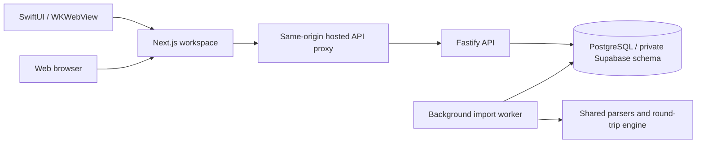

# Tradeform

**Turn trades into progress.**

Tradeform is an account-focused trading journal with a responsive web workspace, an iOS app, and a multi-user PostgreSQL backend. It builds on the MIT-licensed [LuxAlgo Trade Journal](https://github.com/LuxAlgo/trade-journal) and shares its execution parsers, round-trip engine, metrics and Edge Score calculations.

This repository is the working Tradeform fork. The original SQLite application remains in the codebase; its broader features are described in the [original project guide](docs/upstream-readme.md). Those features are not all available in the new hosted workspace.

## Current experience

Register with an email and password or sign in, then land on **Overview**. Pick a broker account to see only that account’s performance and trades. The account picker also offers **Set up a new broker account**.

| Tab | Available functionality |
| --- | --- |
| Overview | Account selector; day, week, two weeks, month, three months, six months, year and all-time filters; end date; equity chart; net P&L, money made/lost, win rate, profit factor, drawdown, fees, symbol and sector breakdowns, and performance patterns. |
| Trades | Account-specific history with cursor pagination; trade details and editable reviews, sector, stop loss and profit target. |
| Journal | Manual trade entry and dated reflection notes belonging to the selected account. |
| Import | CSV statement upload into a chosen account; statement timezone; background job status; duplicate detection and a link to imported trades. |
| Settings | Broker account creation, editing and permanent deletion; daytime/nighttime appearance; timezone and other journal preferences; sign out. |

Deleting a broker account requires a separate confirmation warning. It permanently removes that account’s fills, trades, imports, reviews and account journal entries. Cancelling sends no deletion request. This deletes a **broker account**, not the user’s login identity.

The iOS app has the approved mint TF icon, branded splash screen and tagline. It opens its configured backend automatically and retains valid login cookies between launches. Users do not type a hosting address or receive bundled passwords.

## Architecture



- **Web:** Next.js 15 and React. The Tradeform workspace lives at `/workspace`. The proxy keeps database credentials and service connections on the server.
- **API:** Fastify with pooled PostgreSQL connections, validated inputs and private email sessions. The browser receives an HttpOnly session cookie; logout revokes the session.
- **Database:** Ordinary PostgreSQL, with a private `tradeform` schema on the configured Supabase project. Transaction-scoped owner identity, forced row-level security and restricted API/worker roles isolate users.
- **Worker:** Persistent import jobs, idempotency, atomic fill insertion, leases, retries and crash recovery. Account-level locking protects conflicting writes. Trade calculations use the shared core engine.
- **iOS:** SwiftUI shell around the same workspace, using WKWebView and persistent website storage. It requires a reachable server and is not an offline native rewrite.

Supabase currently supplies **database hosting**. Tradeform’s users are stored in `tradeform.journal_users`, not Supabase `auth.users`. Do not set `SUPABASE_URL` simply to connect the database: that setting changes the authentication verifier and requires a separate auth integration.

## Repository layout

| Path | Purpose |
| --- | --- |
| `apps/web` | Tradeform workspace, hosted proxy, OAuth routes and original SQLite application. |
| `apps/api` | PostgreSQL API, worker, migrations, Supabase transfer utility and integration tests. |
| `apps/ios` | Xcode project, SwiftUI/WebKit app, native assets and URL configuration tests. |
| `packages/core` | Executions, round trips, trade metrics and Edge Score calculations. |
| `packages/importers` | CSV/HTML statement detection and parsers, including TD activity CSV support. |
| `scripts/hosted-postgres.py` | Disposable local PostgreSQL development/test setup. |
| `scripts/hosted-local.py` | API, worker, preview and isolated test launcher. |
| `docs` | Architecture, migration, OAuth, branding, import formats and measured verification results. |

## Requirements

- Node.js **22+**, pnpm **11.0.8** (pinned in `package.json`) and Python 3.
- PostgreSQL command-line tools (`initdb`, `pg_ctl`, `psql`) on `PATH` for local development and database integration tests.
- macOS and Xcode for the iOS app; deployment target iOS **17+**.
- A Git checkout of this repository and local configuration kept outside version control.

```bash
git clone https://github.com/EAniwa/trade-journal.git
cd trade-journal
pnpm install --frozen-lockfile
```

## Run Tradeform with local PostgreSQL

The helper uses macOS-oriented `/private/tmp` paths. Its temporary cluster is for development/testing, not durable production storage.

```bash
python3 scripts/hosted-postgres.py
JOURNAL_PREVIEW=1 NEXT_PUBLIC_JOURNAL_DEMO=0 pnpm build
JOURNAL_CONFIG_FILE=/private/tmp/trade-journal-hosted-config.json python3 scripts/hosted-local.py stack
```

Open **http://localhost:3002/workspace**, create an email account and sign in. The launcher starts the web preview on port **3002**, the API on loopback port **4000**, and a background worker. Stop it with Ctrl+C. Rebuild and restart after source changes; the preview serves the production build and does not hot reload.

The local helper creates restricted roles and writes generated connection credentials to a mode-0600 temporary configuration file. Never commit that file. The local launcher enables registration and, for a local runtime, the server demo endpoint; production configuration must explicitly control both.

The original SQLite application can still be run separately with `pnpm dev` on port 3000. Its data model and authentication differ from Tradeform hosted mode. Hosted mode blocks the legacy SQLite API routes. Do not use the original Docker setup as a deployment recipe for the new PostgreSQL stack.

## Run with Supabase

The configured development stack uses an ignored root `supabase-runtime.json` when present. An explicit `JOURNAL_CONFIG_FILE` overrides it. A fresh clone does not include credentials or private connection configuration.

Follow [the Supabase migration guide](docs/supabase-migration.md) to provision restricted roles, transfer data and verify isolation. The transfer utility refuses an already populated target and does not remove source data. It supports the PostgreSQL journal, not an automatic migration of legacy SQLite journals.
### Combine accounts in a reporting currency

Choose each account's currency from the dropdown when creating it. The dashboard and calendar use that currency for native amounts. To combine accounts with different currencies, open **Settings → Currency conversion**, choose a reporting currency, enter your own baseline rates, and enable conversion. Each rate means **1 unit of the account currency = the entered amount in the reporting currency**; the reporting currency itself always has a rate of 1.

Conversion works entirely offline and uses no rate service or API key. Saved rates apply consistently to P&L, fees, starting balances, charts, drawdown and other monetary metrics. These are fixed-rate trading-performance figures, not live FX valuations or broker conversion amounts. Updating rates recalculates displayed history; original records remain unchanged, and trade details and reports continue using their original account data. Until all required rates are saved, mixed-currency dashboard and calendar selections show separate currency totals rather than a combined amount.

## Why this exists

```bash
JOURNAL_CONFIG_FILE=/absolute/path/to/private-runtime.json python3 scripts/hosted-local.py stack
```

The runtime file contains API/worker connection URLs and optional schema, TLS, CA certificate and pool settings. Keep it private with mode 0600. Certificate verification is required for remote database connections. The tests launcher always uses the isolated local test configuration rather than this remote runtime.
## Features

|                          |                                                                                                                                                                                                                                                                                                                                                                                                                                                                                                                                                            |
| ------------------------ | ---------------------------------------------------------------------------------------------------------------------------------------------------------------------------------------------------------------------------------------------------------------------------------------------------------------------------------------------------------------------------------------------------------------------------------------------------------------------------------------------------------------------------------------------------------- |
| **Broker sync**          | Read-only sync via [`@luxalgo/broker-sdk`](https://github.com/LuxAlgo/broker-sdk): Alpaca, Binance, Bybit, Coinbase, Kraken, OKX, Tradier, IBKR Flex, Hyperliquid, Questrade, Topstep, Trading212, Webull, Crypto.com, E*TRADE, Public, Charles Schwab, TradeStation, tastytrade, Robinhood Crypto, Gemini, and KuCoin. Connect forms render straight from SDK metadata.                                                                                                                                                                                   |
| **Statement import**     | **14 documented formats**, auto-detected: **TradeZella** and **Tradervue** (CSV migration), TradingView (paper and strategy exports), MetaTrader 4 and 5, ThinkorSwim, IBKR (activity + Flex), NinjaTrader, Tradovate, TopstepX, Webull, DAS Trader, plus a column mapper for any other CSV. Matching execution records dedupe within an account; review warnings and skipped rows before committing an import. Have an export we don't recognize? Open an issue with an anonymized sample; real files are the most useful contribution this repo can get. |
| **Round-trip engine**    | Flat-to-flat position cycles from raw fills. FIFO / LIFO / weighted-average per account. Partial fills, scale-ins, flips, futures multipliers. Annotations survive rebuilds.                                                                                                                                                                                                                                                                                                                                                                               |
| **Analytics**            | Net/gross P&L, win and day-win rates, profit factor, expectancy, R multiples, streaks, drawdown and recovery, profit concentration, duration/time-of-day/weekday performance, per-symbol/tag/mistake/playbook breakdowns. Advanced filters on every dimension, comparison groups, and a two-way cross-analysis matrix. Reports also include rolling performance trends and a trade explorer scatter plot, with saved MAE/MFE estimates where available.                                                                                                    |
| **Dashboard**            | P&L calendar with weekly totals, cumulative and daily P&L, gauges, the open **Edge Score v2** radar, open positions, time-of-day performance. Drag cards to rearrange, hide what you don't use, save named layouts. Calendar insights highlight daily patterns. Light/dark themes, a collapsible sidebar, and mobile navigation support smaller screens.                                                                                                                                                                                                   |
| **Trade pages**          | Charted on [Vela](https://www.npmjs.com/package/@luxalgo/vela) with entry/exit markers and P&L labels: fill paths from recorded executions, optional user-selected market candles, and trade replay. Estimated MAE/MFE, running P&L, executions, ratings, stops/targets, tags, mistakes.                                                                                                                                                                                                                                                                   |
| **Daily journal**        | Day stats, intraday P&L curve, autosaving Markdown notes with templates and attachments (images, PDFs). Type them or **dictate** them with browser speech recognition (no journal API key required; browser support and speech processing vary).                                                                                                                                                                                                                                                                                                           |
| **Notebook & playbooks** | Folders, search, tags, trade links; named setups with rule checklists scored per trade, with adherence and followed-vs-broken performance in Reports.                                                                                                                                                                                                                                                                                                                                                                                                      |
| **AI reflection**        | Bring your own Anthropic or OpenAI API key: session recaps, per-trade critiques, "ask your journal" over your own aggregates. Key encrypted at rest; requests go from your server to the model, nowhere else.                                                                                                                                                                                                                                                                                                                                              |
| **Routines & misses**    | Pre-, during- and post-session routines with weekday schedules and a 13-week history; a missed-opportunity log kept out of your trading metrics.                                                                                                                                                                                                                                                                                                                                                                                                           |
| **Journal defaults**     | Configure breakeven tolerance, plus fee and stop/target rules per account and symbol; set timezone and contract multipliers for consistent calculations.                                                                                                                                                                                                                                                                                                                                                                                                   |
| **Prop firms**           | Evaluation and reset expenses, refunds, payout requests, partial receipts, reversals, cash ROI, account phases, renewal reminders, attachments, and generic cash CSV import/export. Separate from trade P&L.                                                                                                                                                                                                                                                                                                                                               |
| **Privacy & export**     | Privacy mode masks every monetary value (charts keep their shape) and persists across tabs. Trades export to CSV, reviews to PDF or PNG, and journal records to JSON; credentials, candle datasets, and attachment binaries are excluded from that export.                                                                                                                                                                                                                                                                                                 |

IBKR broker sync uses **Settings → General → Default import timezone** for Flex
timestamps without an offset. Existing synced accounts with unknown or different
timezone provenance require recovery into a separate account; see
[IBKR timezone recovery](docs/importers.md#ibkr-broker-sync-and-timezone-recovery).

## Screenshots

Captured from the local app with generated demo trades and fictional prop firm records. Expand a view to inspect it at full width.

<details>
<summary><strong>Reports — rolling performance trends</strong></summary>


Compare recent rolling results with the full trading history. Reports also offer a trade explorer, breakdowns, comparison groups, and cross-analysis.

To inspect registered users safely in the Supabase SQL editor:

```sql
SELECT id, email, created_at
FROM tradeform.journal_users
ORDER BY created_at DESC;

SELECT id, user_id, name, currency
FROM tradeform.journal_accounts;
```

Avoid selecting password hashes, session hashes or connection credentials for routine inspection.

## Server configuration

| Variable | Purpose |
| --- | --- |
| `JOURNAL_CONFIG_FILE` | Private JSON configuration used by the Python launcher. |
| `JOURNAL_DATABASE_URL` | Restricted API database connection. |
| `JOURNAL_WORKER_URL` | Restricted worker connection for queue functions. |
| `JOURNAL_DATABASE_SCHEMA` | Database schema (`public` locally; `tradeform` for the provisioned Supabase runtime). |
| `JOURNAL_DATABASE_SSL` | Set to `1` for verified remote TLS. |
| `JOURNAL_DATABASE_CA_FILE` | Optional CA certificate file for the database. |
| `JOURNAL_DATABASE_POOL_MAX` | API/worker pool size; budget total connections across all replicas. |
| `JOURNAL_SERVICE_URL` | Private API URL used by the web proxy. |
| `JOURNAL_HOSTED_ONLY` | Set to `1` to isolate hosted mode from legacy SQLite routes. |
| `JOURNAL_ALLOW_REGISTRATION` | Set to `1` to allow email registration. |
| `JOURNAL_DEMO` | Server demo access; keep disabled in production. |
| `GOOGLE_CLIENT_ID`, `GOOGLE_CLIENT_SECRET`, `GOOGLE_REDIRECT_URI` | Optional backend Google OAuth configuration. |

Do not put secrets into `NEXT_PUBLIC_` variables. Apply SQL migrations with a trusted migration owner, not a runtime role. See [scaling and deployment notes](docs/scaling.md) for role restrictions, network boundaries and remaining load-test work.
**Settings → General** has separate **Display timezone** and **Default import timezone** fields. Use the broker statement's zone for imports and your preferred zone for trade times, analytics and journal days. Each file can override its statement timezone; the preview shows converted execution times before saving. Existing timestamps are unchanged by settings edits. See [timezone setup and correcting earlier imports](docs/importers.md#statement-and-display-timezones).

## iOS simulator and phone

Open `apps/ios/TradeJournal.xcodeproj` in Xcode, select the **TradeJournal** scheme and an iOS simulator, then run. Simulator builds use `http://localhost:3002` by default. Start the server first.

For a phone, set **`JOURNAL_SERVER_URL`** once in Xcode build settings to a server the phone can reach. The current Debug configuration includes a local development Wi-Fi address; replace it for your network. A phone cannot reach the Mac through `localhost`. Keep the Mac/server running and use the same network for local testing. Use a stable HTTPS application URL for distribution.

Select your own signing team for a physical device and complete Apple’s device trust/developer-mode steps as required. The checked-in development team setting is not a signing credential. The bundle identifier remains `com.tradejournal.ios` to preserve installed data. Web-only updates require a server rebuild/restart and app reload; native assets and configuration changes require a new iOS build.
**Settings → Data & backups → Full backup (JSON)** includes accounts (without credentials), executions, trades and annotations, daily journal entries, notebook folders and notes, templates, playbooks and rule checks, routines, missed trades, journal defaults, prop firm records and their audit history, and attachment metadata. Trades also export as CSV; review exports support PDF and PNG.

See [the iOS guide](apps/ios/README.md) for native behavior and verification.

## CSV imports and performance

A `.csv` extension alone does not establish a supported statement format. Columns and record structure must match a parser. The hosted workspace uses automatic detection; the original application’s general CSV mapping UI has not been ported into it. See [import format documentation](docs/importers.md) and the parser tests for supported layouts.

TD activity exports are supported, including statement preambles, signed buy/sell quantities, fees, option expiry rows and contract multipliers. Non-trading cash/interest rows do not become executions. Preserve the original broker export and select its timezone. Duplicate fills are skipped **within the chosen account**; an already imported file reports existing fills rather than adding another copy.

Performance is scoped to one account and its currency. Closed trades are assigned to periods by their close date; account timezone and the selected end date define the calendar window. Sector breakdowns use saved trade annotations; missing sectors appear as **Unclassified**. There is no automatic sector lookup or live market-data enrichment in this workspace.

## Tests and verification

```bash
python3 scripts/hosted-postgres.py
python3 scripts/hosted-local.py tests
pnpm --filter journal-api typecheck
JOURNAL_PREVIEW=1 NEXT_PUBLIC_JOURNAL_DEMO=0 pnpm build
```

Run integration tests against the isolated local cluster. Their fixtures create and remove disposable users and accounts; never point the test connections at a production database. `pnpm test` runs Vitest, but database integration coverage requires the connection variables supplied by the helper.

Coverage includes account ownership, forced RLS, sessions, imports and duplicate handling, job recovery, optimistic document updates, period calculations, account switching with delayed requests, mobile-safe import identifiers, same-origin request checks, and account deletion/confirmation/cancellation. An optional TD test reads an external real statement only when `TD_REAL_STATEMENT` is set; that personal statement is not in this repository.

Simulator compilation can be checked without signing:

```bash
xcodebuild -project apps/ios/TradeJournal.xcodeproj -scheme TradeJournal \
  -destination 'generic/platform=iOS Simulator' CODE_SIGNING_ALLOWED=NO build
```

Measured local and remote latency results live in [local benchmark results](docs/hosted-local-latency.json) and [Supabase verification results](docs/supabase-live-verification.json). They describe specific fixtures and machines, not guaranteed production latency or concurrent-user capacity.

## Known limits and next iterations

- Google integration is prepared and tested with controlled fixtures; real sign-in awaits Google OAuth credentials and an end-to-end provider test. Email registration/login works independently.
- Email verification and password recovery are not implemented.
- Permanent application hosting, a stable HTTPS URL, operational monitoring, tested backup restoration and App Store distribution remain deployment work.
- The worker rebuilds account trades after imports. Large account histories and sustained multi-user load need representative profiling before promising scale.
- Legacy broker sync, AI reflection, market replay, prop-firm tools, attachments and broader notebook/playbook features have not been ported into the hosted workspace.
- Supabase Auth migration and account linking are separate from the completed database cutover.
- The iOS app depends on connectivity; no offline synchronization is implemented.

## Further documentation

- [Architecture and scaling](docs/scaling.md)
- [Supabase migration and cutover](docs/supabase-migration.md)
- [Google OAuth integration](docs/google-login.md)
- [Branding](docs/branding.md)
- [Import formats](docs/importers.md)
- [Edge Score](docs/edge-score.md)
- [Original SQLite project guide](docs/upstream-readme.md)
- [Contributing](CONTRIBUTING.md) and [security reporting](SECURITY.md)

## License and attribution

The underlying project is licensed under [MIT](LICENSE), © LuxAlgo Global, LLC. Preserve its license and attribution. Tradeform is this fork’s product branding; LuxAlgo’s marks remain subject to the upstream [trademark policy](TRADEMARKS.md). Journal calculations describe recorded trading results and should be checked against broker statements.
